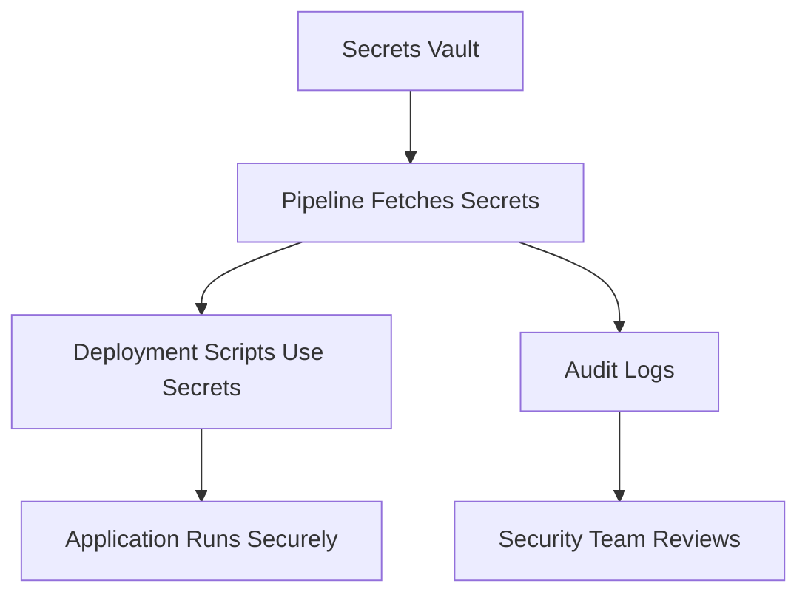

## Secrets Management in DevOps Pipelines

Storing sensitive information like passwords, API keys, or tokens in code repositories is risky. **Proper secrets management** ensures credentials are secure while still accessible to automated pipelines.

---

### Why Secrets Management Matters

- **Security:** Prevent unauthorized access  
- **Compliance:** Meet industry standards (e.g., PCI, SOC2)  
- **Automation:** Pipelines can still use secrets without exposing them  
- **Auditability:** Track who accessed or modified secrets  

---

### Example Workflow

1. Store secrets in a **vault** or secure service  
2. Configure CI/CD pipeline to fetch secrets at runtime  
3. Use secrets for deployment, configuration, or scripts  
4. Rotate secrets regularly and audit usage  

### Visual Diagram

---

### Tools for Secrets Management

- HashiCorp Vault: Centralized secret storage with policies
- AWS Secrets Manager / Parameter Store
- GitHub Actions Secrets (for GitHub pipelines)
- Azure Key Vault
- Kubernetes Secrets (with encryption at rest)

---

### Example: GitHub Actions Secret Usage
```yaml
jobs:
  deploy:
    runs-on: ubuntu-latest
    steps:
      - uses: actions/checkout@v3
      - name: Deploy
        run: ./deploy.sh
        env:
          API_KEY: ${{ secrets.API_KEY }}
```
---

### Best Practices

- Never commit secrets to Git
- Use environment variables or secret managers
- Rotate secrets regularly
- Limit access to only necessary roles

### Common Pitfalls

- Hardcoding credentials in scripts or Dockerfiles
- Sharing secrets across multiple projects without isolation
- Ignoring audit logs for sensitive operations

## Conclusion

Secure secrets management is critical for DevOps pipelines, allowing automation without compromising security or compliance. Using vaults and CI/CD secret features ensures safe, auditable, and reliable workflows.