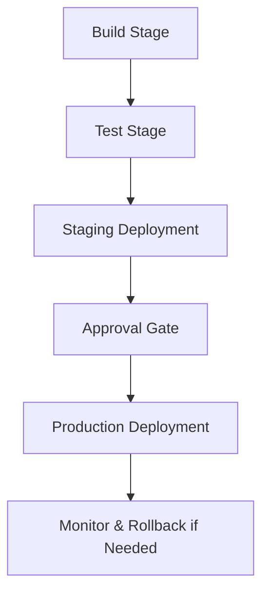

## Advanced CI/CD with Multi-Stage Pipelines

Single-stage pipelines are limited. Multi-stage pipelines separate **build, test, and deploy stages**, improving reliability, observability, and rollback capabilities.

---

### Why Multi-Stage Pipelines Matter

- **Isolation:** Errors in one stage don’t impact others  
- **Better Testing:** Run unit, integration, and E2E tests in dedicated stages  
- **Conditional Deployments:** Deploy only if all stages succeed  
- **Parallelization:** Run multiple tests concurrently  

---

### Example Workflow

1. **Build Stage:** Compile code, lint, and run unit tests  
2. **Test Stage:** Integration and E2E tests  
3. **Staging Deployment:** Deploy to staging if tests pass  
4. **Approval Gate:** Manual or automated approval before production  
5. **Production Deployment:** Deploy with rollback options  

### Visual Diagram

---

### GitHub Actions Multi-Stage Example

```yaml
name: Multi-Stage CI/CD

on:
  push:
    branches: [develop, main]

jobs:
  build:
    runs-on: ubuntu-latest
    steps:
      - uses: actions/checkout@v3
      - name: Build
        run: npm run build

  test:
    needs: build
    runs-on: ubuntu-latest
    steps:
      - uses: actions/checkout@v3
      - name: Run Tests
        run: npm test

  deploy-staging:
    needs: test
    runs-on: ubuntu-latest
    steps:
      - name: Deploy Staging
        run: ./deploy-staging.sh

  approval:
    needs: deploy-staging
    runs-on: ubuntu-latest
    steps:
      - name: Wait for Approval
        uses: hmarr/auto-approve-action@v2

  deploy-production:
    needs: approval
    runs-on: ubuntu-latest
    steps:
      - name: Deploy Production
        run: ./deploy-production.sh
```
---

### Best Practices

- Use clear dependencies between stages (`needs`)
- Split heavy pipelines to parallelize tests
- Include rollback steps in production stage
- Notify teams at each stage for visibility

---

### Common Pitfalls

- Combining too many tasks in one stage
- Ignoring test failures due to stage dependencies
- Deploying without monitoring post-production

## Conclusion

Multi-stage pipelines enhance pipeline reliability, visibility, and control, enabling DevOps teams to release faster while minimizing risk.