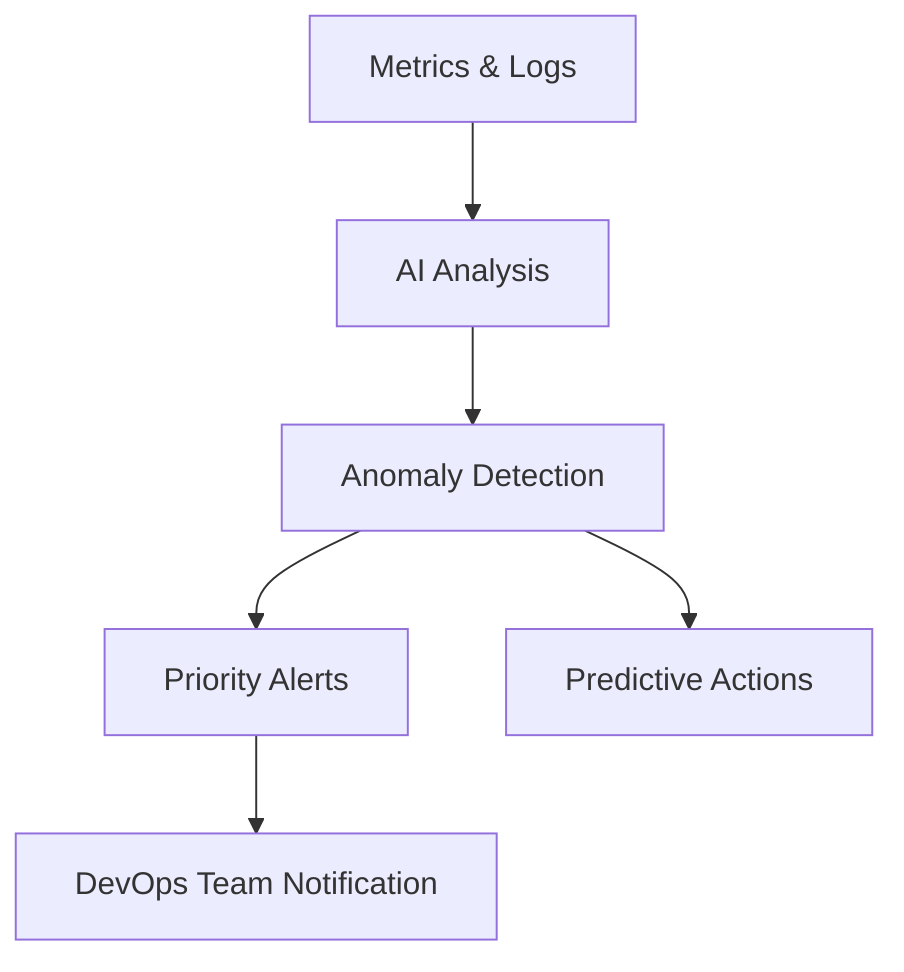

## AI-Driven Observability for DevOps

Traditional monitoring is reactive. **AI-driven observability** uses machine learning to detect anomalies, predict incidents, and provide actionable insights before users are affected.

---

### Why AI Observability Matters

- **Proactive Incident Detection:** Identify issues before they impact users  
- **Root Cause Analysis:** AI suggests probable causes for faster resolution  
- **Predictive Scaling:** Anticipate load spikes and scale automatically  
- **Optimized Alerts:** Reduce alert fatigue by prioritizing critical events  

---

### Example Workflow

1. Collect metrics and logs from applications and infrastructure  
2. AI analyzes historical trends and identifies anomalies  
3. Alerts are prioritized and sent to engineers  
4. Predictive recommendations guide scaling or fixes  

### Visual Diagram

---

### Sample Code Snippet
```python
import numpy as np

# Simulate anomaly detection
metrics = [0.1, 0.12, 0.11, 0.9]  # sudden spike
threshold = np.mean(metrics) + 3*np.std(metrics)

for value in metrics:
    if value > threshold:
        print("Anomaly detected! Notify team.")
```
---

### Best Practices

- Train AI models on historical data
- Integrate with CI/CD pipelines for continuous monitoring
- Prioritize actionable alerts to avoid noise
- Combine metrics, logs, and traces for holistic observability

---

### Common Pitfalls

- Using insufficient historical data for AI models
- Ignoring integration with existing monitoring tools
- Relying solely on AI without human validation

## Conclusion

AI-driven observability transforms DevOps from reactive to proactive, reducing downtime, improving reliability, and enabling faster decision-making for engineers.