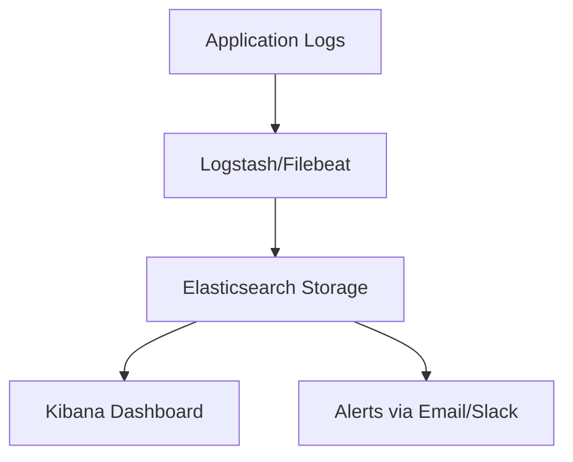

## Log Aggregation and Analysis with ELK Stack

Managing logs across multiple services and servers is challenging. The **ELK Stack** provides centralized logging, powerful search, and visualization to streamline monitoring and troubleshooting.

---

### Why ELK Stack Matters

- **Centralized Logs:** Collect logs from all services in one place  
- **Efficient Troubleshooting:** Search and filter logs quickly  
- **Visualization:** Gain insights using dashboards  
- **Alerting:** Detect anomalies and failures proactively  

---

### Example Workflow

1. Collect logs from applications and servers  
2. Ship logs to **Logstash** or **Filebeat**  
3. Store in **Elasticsearch**  
4. Visualize and analyze using **Kibana**  
5. Create alerts for critical events  

### Visual Diagram

---

### Sample Logstash Config
```yaml
input {
  file {
    path => "/var/log/app/*.log"
    start_position => "beginning"
  }
}
output {
  elasticsearch {
    hosts => ["http://localhost:9200"]
    index => "app-logs-%{+YYYY.MM.dd}"
  }
}
```

---

### Kibana Dashboard Example
1. Create visualizations (e.g., error rates, response times)
2. Combine visualizations into dashboards for overview
3. Set up alerts based on log patterns (e.g., high error rates)

---

### Best Practices

- Standardize log formats across services
- Use indices and retention policies in Elasticsearch
- Secure access to logs and dashboards
- Create dashboards for high-level and detailed views

---

### Common Pitfalls

- Storing too many logs without retention, causing storage issues
- Ignoring log parsing and structuring
- Not monitoring ELK performance
- Failing to secure sensitive log data

## Conclusion

The ELK Stack enables centralized, searchable, and visualized logs, empowering DevOps teams to quickly detect and resolve issues while gaining operational insights.