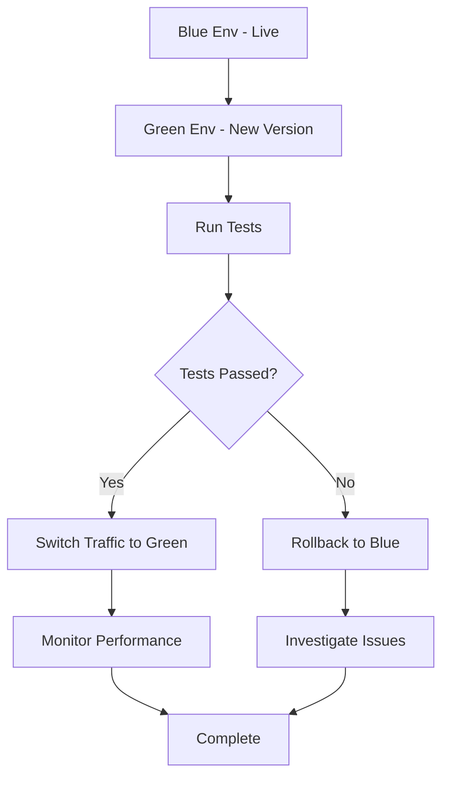

## Blue-Green Deployment in Production

Deploying updates without downtime is challenging. **Blue-Green Deployment** creates two identical environments — one live (Blue) and one idle (Green) — allowing seamless releases with minimal risk.

---

### Why Blue-Green Matters

- **Zero-Downtime Deployments:** Users experience no service interruptions  
- **Rollback Safety:** Quickly revert to the previous environment if issues occur  
- **Controlled Release:** Test new features in the Green environment  
- **Predictable Traffic Routing:** Direct users to stable environment  

---

### Workflow Example

1. Deploy new version to Green environment  
2. Run integration and smoke tests in Green  
3. Switch traffic from Blue to Green  
4. Monitor metrics and logs  
5. Keep Blue as backup in case of rollback  

### Visual Diagram


---

### Sample Kubernetes Service Switch

```yaml
apiVersion: v1
kind: Service
metadata:
  name: webapp-service
spec:
  selector:
    app: webapp-green
  ports:
    - protocol: TCP
      port: 80
      targetPort: 8080
```
---

### Best Practices

- Keep Blue environment intact until Green is stable
- Automate testing in the Green environment
- Test thoroughly in Green before switching traffic
- Monitor performance and error rates
- Automate traffic switch and rollback

---

### Common Pitfalls

- Not monitoring the idle environment before switching
- Inconsistent configuration between Blue and Green
- Switching traffic too quickly without gradual validation

## Conclusion

Blue-Green Deployment allows DevOps teams to deploy with confidence, ensuring zero-downtime, safer updates, and quick rollback options.