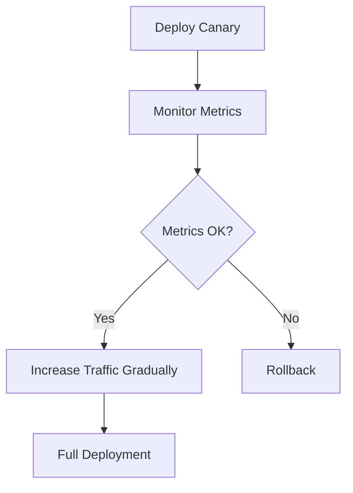

## Canary Deployment for Progressive Releases

**Canary Deployment** releases new software to a small subset of users before rolling out widely, reducing risk and enabling real-time monitoring of changes.

---

### Why Canary Deployment Matters

- **Risk Mitigation:** Issues affect only a small percentage of users  
- **Performance Monitoring:** Validate new features under real traffic  
- **Gradual Rollout:** Incrementally increase user exposure  
- **Rollback Flexibility:** Easily revert if anomalies occur  

---

### Workflow Example

1. Deploy new version to a small set of pods/users  
2. Monitor performance, errors, and user feedback  
3. Gradually increase traffic to new version  
4. Rollback if issues arise  

### Visual Diagram

---

### Sample Kubernetes Canary Deployment
```yaml
apiVersion: apps/v1
kind: Deployment
metadata:
  name: webapp-canary
spec:
  replicas: 1
  selector:
    matchLabels:
      app: webapp
      version: canary
  template:
    metadata:
      labels:
        app: webapp
        version: canary
    spec:
      containers:
      - name: webapp
        image: myregistry/webapp:v2
        ports:
        - containerPort: 80
```

---

### Best Practices

- Start with a small percentage of traffic
- Monitor logs, metrics, and user feedback continuously
- Automate traffic shift and rollback processes
- Use feature flags for more control

---

### Common Pitfalls

- Deploying to too many users at once
- Ignoring real-time metrics or alerts
- Not planning rollback strategy

## Conclusion

Canary Deployment allows progressive, controlled rollouts, minimizing risk while ensuring a smooth user experience.