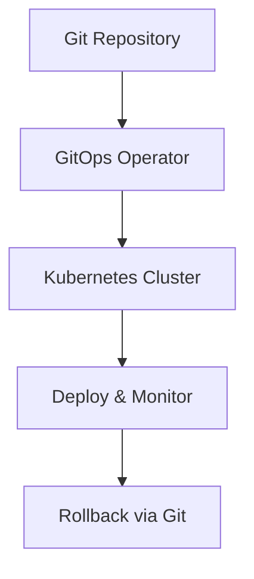

## GitOps for Modern DevOps

GitOps is a **declarative approach** to infrastructure and application management using Git as the single source of truth. Changes are automatically applied and monitored, ensuring consistency across environments.

---

### Why GitOps Matters

- **Declarative Configurations:** Infrastructure and apps are defined as code  
- **Version Control:** Track and audit every change  
- **Automation:** Pull-based deployment ensures changes are applied consistently  
- **Rollback Friendly:** Easily revert to previous Git states  

---

### Example Workflow

1. Define infrastructure and apps in Git repositories  
2. GitOps operator (e.g., ArgoCD, Flux) monitors repositories  
3. Operator applies changes automatically to the cluster  
4. Rollback possible by reverting Git commit  
5. Notifications on deployment status  

### Visual Diagram

---

### Sample ArgoCD Application YAML
```yaml
apiVersion: argoproj.io/v1alpha1
kind: Application
metadata:
  name: webapp
spec:
  project: default
  source:
    repoURL: 'https://github.com/myorg/webapp.git'
    path: 'deploy'
    targetRevision: HEAD
  destination:
    server: 'https://kubernetes.default.svc'
    namespace: default
  syncPolicy:
    automated:
      prune: true
      selfHeal: true
```
---

### Best Practices

- Keep Git repository as single source of truth
- Automate health checks and alerts
- Review pull requests before applying changes
- Organize multiple environments with separate branches

---

### Common Pitfalls

- Directly modifying cluster without Git (breaks GitOps)
- Ignoring security and RBAC in GitOps operators
- Large monolithic repos leading to slow deployments

## Conclusion

GitOps brings consistency, auditability, and automation to DevOps workflows, enabling faster and safer deployments across clusters.