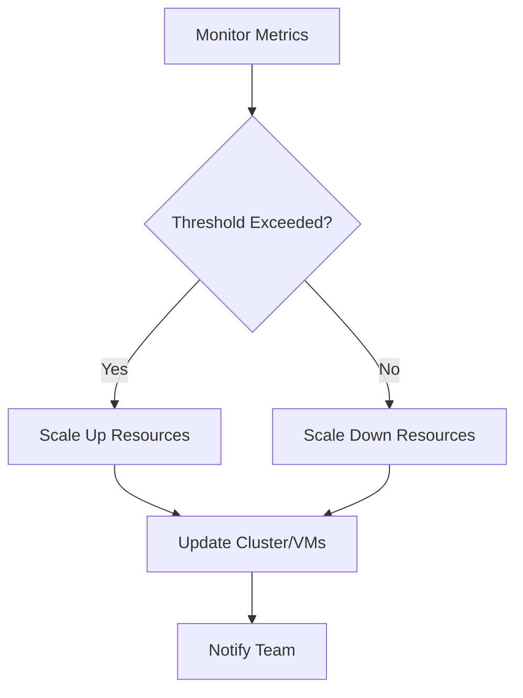

## Auto-Scaling Strategies in DevOps

Auto-scaling automatically adjusts compute resources based on demand, ensuring **high availability** and **cost efficiency**.

---

### Why Auto-Scaling Matters

- **Maintain Performance:** Handle spikes without downtime  
- **Optimize Costs:** Scale down unused resources  
- **High Availability:** Maintain service continuity  
- **Elasticity:** Respond to unpredictable load  

---

### Example Workflow

1. Define scaling metrics (CPU, memory, requests)  
2. Set thresholds for scaling up or down  
3. Monitor metrics continuously  
4. Trigger scaling events automatically  
5. Optional: integrate with alerting and dashboards  

### Visual Diagram

---

### Sample Kubernetes Horizontal Pod Autoscaler
```yaml
apiVersion: autoscaling/v2
kind: HorizontalPodAutoscaler
metadata:
  name: webapp-hpa
spec:
  scaleTargetRef:
    apiVersion: apps/v1
    kind: Deployment
    name: webapp
  minReplicas: 2
  maxReplicas: 10
  metrics:
    - type: Resource
      resource:
        name: cpu
        target:
          type: Utilization
          averageUtilization: 70
```
---

### Best Practices

- Choose appropriate metrics for scaling
- Set reasonable min/max limits to prevent over/under scaling
- Test scaling under load before production
- Integrate with monitoring and alerting

### Common Pitfalls

- Ignoring cooldown periods leading to flapping
- Using only one metric (may not reflect real load)
- Over-provisioning or under-provisioning

## Conclusion

Auto-scaling ensures resilient, cost-effective, and performance-optimized infrastructure, crucial for modern DevOps pipelines.