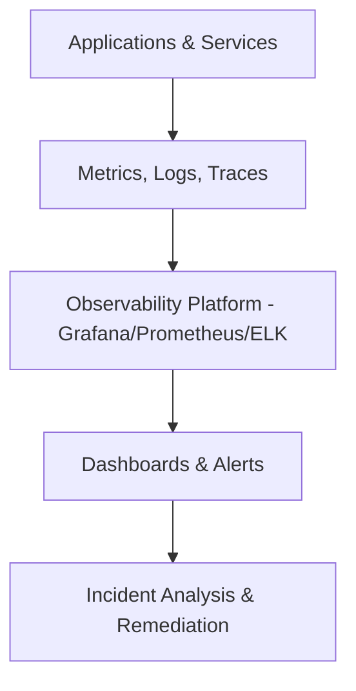

## Observability in DevOps

Observability provides **full visibility into systems** by analyzing metrics, logs, and traces, enabling proactive detection and faster resolution of issues.

---

### Why Observability Matters

- **Detect Issues Proactively:** Spot anomalies before users are affected  
- **Root Cause Analysis:** Understand why failures occur  
- **Improved Reliability:** Ensure system stability  
- **Continuous Feedback:** Optimize DevOps pipelines  

---

### Workflow Example

1. Instrument applications and infrastructure for metrics, logs, and tracing  
2. Aggregate data into a centralized observability platform  
3. Set up dashboards and automated alerts  
4. Analyze incidents and improve processes  

### Visual Diagram


---

### Sample Code Snippet
```python
import logging
import time
from prometheus_client import start_http_server, Summary
# Create a metric to track time spent and requests made.
REQUEST_TIME = Summary('request_processing_seconds', 'Time spent processing request')
# Decorate function with metric.
@REQUEST_TIME.time()
def process_request(t):
    """A dummy function that takes some time."""
    time.sleep(t)
if __name__ == '__main__':
    # Start up the server to expose the metrics.
    start_http_server(8000)
    # Generate some requests.
    while True:
        process_request(1)
        logging.info("Processed a request")
```
---

### Best Practices

- Instrument systems thoroughly
- Use standardized metrics and log formats
- Automate alerts for anomalies
- Continuously refine dashboards and analysis

### Common Pitfalls

- Collecting data without analysis
- Ignoring alert fatigue
- Partial observability due to uninstrumented components

## Conclusion

Observability ensures transparent, measurable, and proactive operations, empowering DevOps teams to maintain high availability and reliability