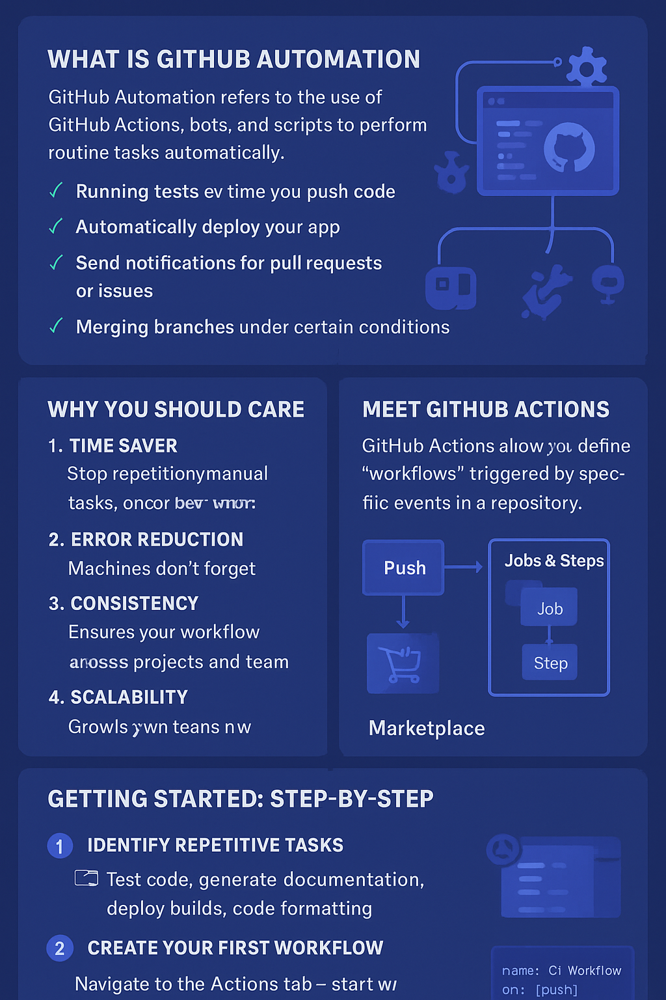

# 🚀 Getting Started with GitHub Automation: Supercharge Your Workflow

In today’s fast-paced tech world, efficiency is everything. Whether you're a developer, DevOps engineer, or tech enthusiast, automating repetitive tasks is a game-changer. Enter <b>GitHub Automation</b>—your key to smarter workflows, faster deployments, and less manual grunt work.

In this post, we’ll explore what GitHub Automation is, why it matters, and how you can get started—even if you’re new to the ecosystem.

## 🔹 What is GitHub Automation?

GitHub Automation refers to the use of <b>GitHub Actions, bots, and scripts</b> to perform routine tasks automatically. Think of it as giving your repository superpowers. Tasks like:

Running tests every time you push code

Automatically deploying your app

Sending notifications for pull requests or issues

Merging branches under certain conditions

…can all happen without you lifting a finger.

It’s like having a personal assistant for your code!

## 🔹 Why You Should Care

Here’s why automation isn’t just a “nice-to-have,” but a must in 2025:

1. <b>Time Saver</b> – Stop repeating manual tasks. Spend your brainpower on creative and critical work.

2. <b>Error Reduction</b> – Machines don’t forget steps. Your tests, deployments, and merges become more reliable.

3. <b>Consistency</b> – Automation ensures your workflow is standard across all projects and team members.

4. <b>Scalability</b> – Your project grows, your automation grows with it. No additional overhead.

## 🔹 Meet GitHub Actions

At the heart of GitHub Automation is GitHub Actions. It allows you to define “workflows” triggered by specific events in your repository.

- <b>Event Triggers</b> – Push, pull request, issue creation, scheduled cron jobs, and more.

- <b>Jobs & Steps</b> – Each workflow consists of jobs (parallel tasks) and steps (individual commands).

- <b>Marketplace</b> – Pre-built actions for everything: code linting, deployments, notifications, security checks, and even AI-assisted tasks!

Example: Automatically run tests on every push to the main branch and deploy to your staging server.

## 🔹 Getting Started: Step-by-Step

Here’s a simple roadmap to kickstart your GitHub Automation journey:

### 1️⃣ Identify Repetitive Tasks

Look for tasks that are routine and error-prone:

- Testing code

- Generating documentation

- Deploying builds

- Code formatting

### 2️⃣ Create Your First Workflow

1. Navigate to your repo → Actions tab → New workflow.

2. Start with a template or from scratch. For example:

```
name: CI Workflow
on: [push]
jobs:
  build:
    runs-on: ubuntu-latest
    steps:
      - uses: actions/checkout@v3
      - name: Run Tests
        run: npm test
```

3. Save → Commit → Watch it run automatically on your next push.

### 3️⃣ Explore Pre-built Actions

GitHub Marketplace has thousands of ready-made actions:

Deployment actions (AWS, Azure, Firebase)

Linting & formatting (ESLint, Prettier)

Notifications (Slack, Discord, Email)

### 4️⃣ Iterate & Improve

Automation is a journey. Monitor workflow logs, optimize steps, and gradually automate more processes.

## 🔹 Pro Tips for Maximum Impact

- <b>Start Small:</b> Automate one task at a time; avoid overwhelming your workflow.

- <b>Use Secrets:</b> Store credentials securely with GitHub Secrets.

- <b>Version Control Your Workflows:</b> Keep your .github/workflows folder under version control.

- <b>Monitor & Alert:</b> Use notifications to catch workflow failures instantly.

## 🔹 Final Thoughts

GitHub Automation is no longer optional—it’s essential. It turns your code repository into a smart, self-operating engine that saves time, reduces errors, and empowers creativity.

Whether you’re a solo developer or leading a large team, automation lets you focus on innovation, not repetition.

💡 <b>Pro Tip:</b> Start experimenting today with GitHub Actions, and in a month, you’ll wonder how you ever managed without it!

## ⚡ Call to Action

If you found this helpful, share this post with your network, and start automating one workflow today!

Also, comment below:
“What’s the first task you’ll automate in your GitHub repo?”

Let’s build smarter, faster, and more fun workflows together! 🚀

