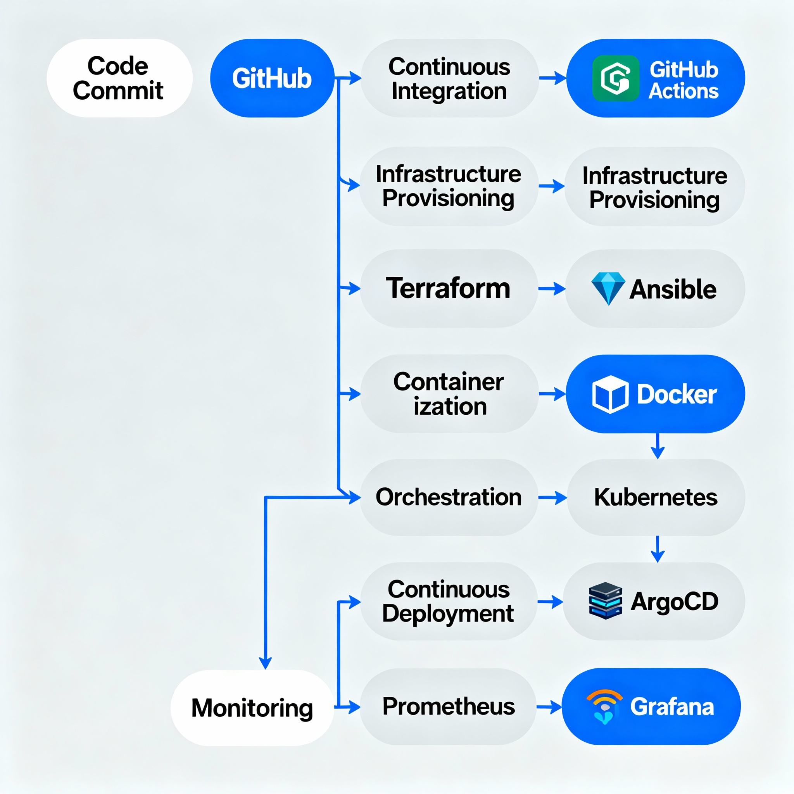

## How Modern Tools Turn Chaos Into Confidence

A year ago, my deployment pipeline was a patchwork of manual steps. Today? It’s fast, resilient, and feels like magic. Here’s how you can build the same—using just code and a handful of connected tools.

---

## 🛠️ Key Tools & Roles

| Tool             | Purpose               | What I Use It For               |
|------------------|----------------------|---------------------------------|
| GitHub Actions   | CI/CD, Automation    | Test, build, deploy             |
| Terraform        | IaC                  | Cloud provisioning              |
| Ansible          | Config Management    | Server setup/config             |
| ArgoCD           | GitOps Deployments   | K8s sync, rollbacks             |
| Prometheus       | Metrics              | Alerting, monitoring            |
| Grafana          | Visualization        | Dashboards, analysis            |

---

## Why Automation Matters Now More Than Ever

Software delivery has changed. No longer is it enough to simply write great code; you have to deliver fast, safely, and with confidence. Modern automation tools move us from brittle manual handoffs to predictable, repeatable workflows. This isn’t just about saving time—it’s about empowering teams and restoring focus for real innovation.

---

## The Pipeline: A Visual Journey



Above, you’ll find the heart of every successful engineering org in 2025—a DevOps pipeline that transforms how code becomes customer value. The arrows show how each automation handoff (testing, provisioning, configuring, deploying, monitoring) makes life easier for developers and ops teams alike.

Let’s walk through each stage and the tools that make it work.

---

### 1. **Code Commit**

Every great product starts with a commit. Developers push changes to their repo, the source of truth.

- **Key Tools:** GitHub, GitLab, Bitbucket

---

### 2. **CI/CD Automation**

Continuous Integration/Continuous Delivery (CI/CD) takes over. Testing, building, and deployment become automatic upon commit.

- **Key Tools:** GitHub Actions, Jenkins, GitLab CI/CD, CircleCI
- **Why:** Immediate feedback, faster releases, fewer mistakes

```
jobs:
    build:
        steps:
            - name: Checkout code
              uses: actions/checkout@v3
            - name: Run tests
              run: npm test
            - name: Build container
              run: docker build -t app .
```
---

### 3. **Infrastructure as Code (IaC)**

Servers, networks, and cloud resources are provisioned by code—no more manual setups, just reusable scripts.

- **Key Tools:** Terraform, Pulumi, AWS CloudFormation
- **Why:** Scalability, repeatability, version control for infrastructure

```
resource "aws_instance" "web" {
    ami = "ami-123"
    instance_type = "t2.micro"
}
```
---

### 4. **Configuration Management**

Your freshly-provisioned servers need software, users, configs, and application code. Automation tools ensure they’re properly set up every single time.

- **Key Tools:** Ansible, Chef, Puppet
- **Why:** Consistency, no snowflake servers, security best practices

```
hosts: web
tasks:
    name: Install NGINX
    apt:
        name: nginx
        state: present
```
---

### 5. **Containerization**

Apps run inside containers for portability and reliability across dev, test, and production.

- **Key Tools:** Docker, Podman
- **Why:** "Works anywhere" deployments, lightweight infrastructure

---

### 6. **Automated Deployments**

Orchestration tools handle rollout, scaling, health checks, and rollbacks—no human intervention needed.

- **Key Tools:** Kubernetes, ArgoCD, Spinnaker
- **Why:** Zero-downtime updates, GitOps workflows, easy rollback

---

### 7. **Production Monitoring**

Finally, you want visibility into production: performance, errors, user experience. Monitoring and dashboards close the loop, driving faster recovery and data-driven improvements.

- **Key Tools:** Prometheus, Grafana, Datadog
- **Why:** Early warning, metrics for success, incident response

---

## The Power of Connected Tools

Each tool alone is powerful, but connecting them delivers synergy:
- **Automation** replaces mental overhead with creative engineering.
- **IaC** ensures resources are ready, every time.
- **Config management** gives confidence in every deployment.
- **Containers** and **orchestration** open up scalability.
- **Monitoring** empowers teams to get ahead of problems, not just react.

---

> **Note**
>
> This pipeline is not theoretical—it’s my real workflow. Over time, I've adapted, swapped, and improved tools to fit changing needs. The logos and flow illustrate real handoffs and challenges solved.
>
> Use this as a blueprint, inspiration, or diagnostic for your own DevOps journey. Every org is unique, but the principles are universal.

---

## Common Pitfalls & Pro Tips

- **Don’t neglect monitoring!** Bad things happen fast.
- **Keep configs and infra in version control.** Track changes.
- **Automate rollbacks.** Nothing saves you faster.
- **Invest in documentation and sharing learnings.**
- **Start small—automate one part, then grow.**

---

## Get Involved

- **Comment:** What does your pipeline look like?  
- **Share:** Where do you want to improve?  
- **Explore:** More deep dives and walkthroughs coming soon!

#DevOps #Automation #CI/CD #IaC #AutoshiftOps #Engineering #Cloud #2025

