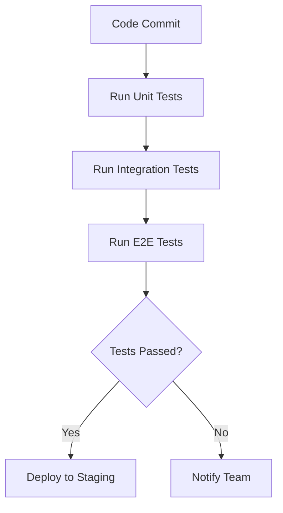

## Automated Testing Strategies in DevOps

Automated testing is a core principle of DevOps. Manual testing slows down deployments and increases human error. By **integrating automated tests in CI/CD pipelines**, DevOps engineers can ensure high-quality releases at speed.

---

### Why Automated Testing Matters

- **Early Bug Detection:** Identify issues before production deployment.  
- **Faster Feedback:** Developers get immediate results on code changes.  
- **Consistency:** Same test runs every time, eliminating variability.  
- **Scalability:** Run hundreds or thousands of tests across multiple environments.  

---

### Types of Automated Tests

1. **Unit Tests:** Test individual functions or modules.  
2. **Integration Tests:** Test interactions between modules or services.  
3. **End-to-End (E2E) Tests:** Simulate real user scenarios.  
4. **Regression Tests:** Ensure new changes do not break existing functionality.  
5. **Performance Tests:** Measure speed, load, and scalability.

---

### Example Workflow

**Scenario:** Testing a Node.js application before deployment.

1. Commit code to `develop` branch  
2. CI pipeline triggers automated tests  
3. Unit and integration tests run first  
4. If tests pass, E2E tests execute  
5. Pipeline fails on errors and notifies developers  

### Visual Diagram


## Sample Test Code
```javascript
// Unit test example using Jest
const sum = (a, b) => a + b;

test('adds 1 + 2 to equal 3', () => {
  expect(sum(1, 2)).toBe(3);
});
```

## Best Practices

- Run fast tests first, slow tests later
- Use mock services to avoid dependencies
- Parallelize tests for efficiency
- Integrate code coverage reports to ensure quality

## Common Pitfalls

- Ignoring flaky tests that fail intermittently
- Skipping regression tests on critical paths
- Overloading CI pipeline with unnecessary tests

## Conclusion

Automated testing ensures reliable, fast, and scalable DevOps pipelines. By designing a thoughtful test strategy, engineers can catch issues early, reduce downtime, and maintain high software quality.