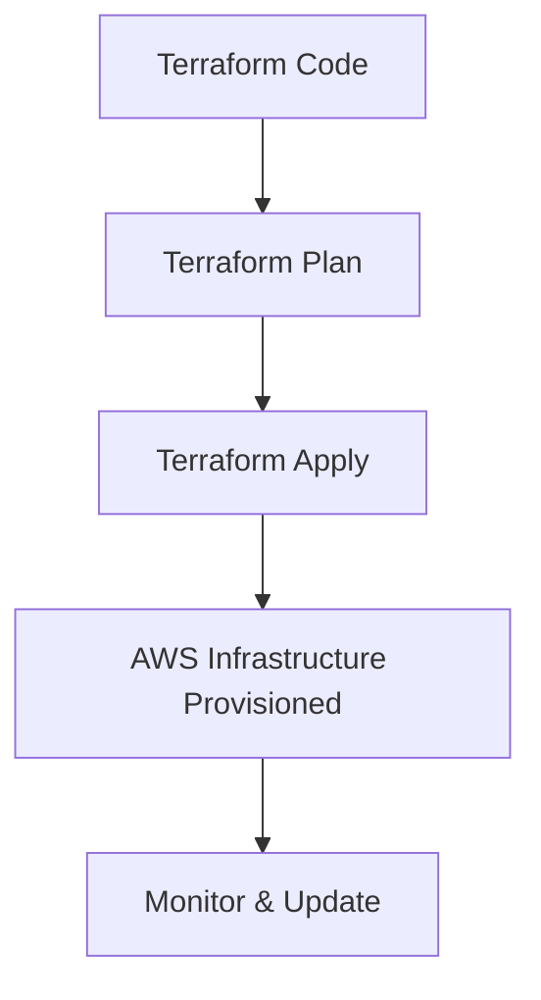

## Infrastructure as Code (IaC) with Terraform

Manual infrastructure management is error-prone and time-consuming. **Terraform** allows DevOps engineers to define, provision, and manage cloud resources using code. This ensures **consistency, scalability, and version control**.

---

### Why Terraform and IaC Matter

- **Version Control:** Track infrastructure changes in Git.  
- **Consistency:** Avoid configuration drift across environments.  
- **Automation:** Provision resources automatically, saving time.  
- **Collaboration:** Teams can review, approve, and reuse IaC modules.  

---

### Example Use Case

**Scenario:** Deploy a web server on AWS.

1. Define AWS EC2 instance using Terraform HCL  
2. Apply Terraform plan to create resources  
3. Monitor infrastructure state  
4. Update or destroy resources as needed  

### Visual Diagram


## Sample Terraform Code
```hcl
provider "aws" {
  region = "us-east-1"
}

resource "aws_instance" "web" {
  ami           = "ami-0abcdef1234567890"
  instance_type = "t2.micro"

  tags = {
    Name = "MyWebServer"
  }
}
```

## Best Practices

- Use modules for reusable infrastructure components

- Keep state files secure (e.g., S3 with encryption)

- Separate environments using workspaces or directories

- Review and approve changes via Git pull requests

## Common Pitfalls

- Hardcoding secrets in Terraform code

- Ignoring drift detection between IaC and actual resources

- Applying changes without reviewing plan

## Conclusion

Terraform enables predictable, repeatable, and automated cloud provisioning, empowering DevOps engineers to manage complex infrastructures efficiently and safely.